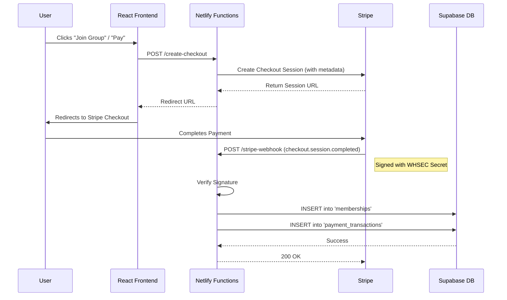

# 🏗️ LowSplit Project Blueprint
> **Version**: 1.0.0  
> **Last Updated**: 2026-02-13

## 1. Executive Summary
**LowSplit** is a SaaS platform that enables users to share digital subscription costs securely. It orchestrates group formation, payment processing, and access management through a modern web interface.

---

## 2. Technology Stack

### **Frontend (Client-Side)**
*   **Framework**: [React 19](https://react.dev/)
*   **Build Tool**: [Vite 7](https://vitejs.dev/)
*   **Routing**: [React Router DOM 7](https://reactrouter.com/)
*   **State Management / Data Fetching**: [TanStack Query (React Query)](https://tanstack.com/query/latest)
*   **Styling**: [Tailwind CSS v3](https://tailwindcss.com/)
*   **Icons**: [Lucide React](https://lucide.dev/)
*   **Forms**: React Hook Form + Zod (Validation)

### **Backend (Serverless & Database)**
*   **Database**: [Supabase](https://supabase.com/) (PostgreSQL)
*   **Authentication**: Supabase Auth (Email/Password + OAuth)
*   **Serverless Functions**: [Netlify Functions](https://docs.netlify.com/functions/overview/) (Node.js) - Handles sensitive logic like Stripe interaction.
*   **Realtime**: Supabase Realtime (for dashboard updates).

### **Payments & Infrastructure**
*   **Payment Processor**: [Stripe](https://stripe.com/) (Checkout & Webhooks).
*   **Hosting/CD**: Netlify (Frontend + Functions).
*   **Version Control**: GitHub.

---

## 3. Core Architecture: Payment Flow
The payment system is the critical backbone. Here is how data flows when a user joins a group:



---

## 4. Current Status (Validations)

| Component | Status | Verification Notes |
| :--- | :--- | :--- |
| **Authentication** | 🟢 Stable | Logins/Signups work via Supabase Auth. |
| **Database** | 🟢 Stable | Schemas defined. RLS needs audit. |
| **Payments (Checkout)** | 🟢 Stable | Stripe Checkout redirects correctly using `lowsplit-app.netlify.app`. |
| **Payments (Webhooks)** | 🟢 Stable | Webhooksverified returning 200 OK and creating DB records. |
| **Recovery** | 🟢 Completed | Manual data recovery for Apple One & Nintendo performed successfully. |
| **Frontend UI** | 🟡 Polishing | Dashboard works, but some responsive adjustments needed for mobile. |

---

## 5. Gap Analysis (What is missing?)

### 🚨 Critical / High Priority
1.  **Transactional Emails**: No system currently sends emails (Welcome, Payment Confirmation, Reset Password).
    *   *Recommendation*: Integrate Resend or SendGrid via Netlify Functions.
2.  **Error Boundaries**: If the app crashes, users see a blank screen. Needs a friendly "Oops" page.
3.  **Terms & Privacy**: Legal pages are placeholders or missing. Critical for Stripe compliance in production.

### 🛠️ Technical Debt & Optimizations
1.  **Supabase RLS Policies**: Security audit needed. Ensure users can ONLY see their own data (Row Level Security).
2.  **Testing**: No automated tests (Unit or E2E).
    *   *Recommendation*: Add Vitest for logic and Playwright for critical flows (Login -> Pay).
3.  **Type Safety**: Codebase is mixed JS/JSX. Migrating to TypeScript would reduce bugs significantly.

---

## 6. Directory Structure Overview
```
/
├── .netlify/functions/   # Serverless Backend (Stripe logic)
├── src/
│   ├── components/       # UI Bricks (Buttons, Cards, Modals)
│   ├── hooks/            # Logic (useAuth, usePayment)
│   ├── lib/              # configs (supabaseClient, utils)
│   ├── pages/            # Full Views (Dashboard, Home)
│   └── main.jsx          # Entry Point
├── supabase/             # SQL Migrations & Types
├── README.md             # Quick Start
├── CHANGELOG.md          # History of changes
└── PROJECT_BLUEPRINT.md  # This document
```
